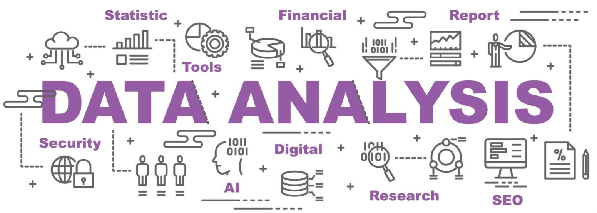

  

  # ¡Hola! Soy Brian Chaupis 👋

  ### Analista de Datos | Matemático & Estadístico | Business Intelligence

  

    
    
  

  ---

  

    Soy un apasionado de los datos con formación en <b>Ciencias Matemáticas</b>. Mi enfoque es transformar datos crudos en decisiones de negocio estratégicas. Me especializo en el ciclo completo del dato: desde la limpieza compleja con Python/SQL hasta la creación de dashboards de alto impacto en Power BI y Tableau, integrando análisis predictivo y estadístico.

## 🛠️ Mi Stack Tecnológico

Un resumen visual de las herramientas y competencias que utilizo para resolver problemas de negocio:

| Análisis & Procesamiento | Bases de Datos | Visualización & BI | Otras Herramientas |
| :---: | :---: | :---: | :---: |
|        |        |        |        |

---

## 🚀 Proyectos Destacados

Aquí presento mis soluciones analíticas más recientes, enfocadas en resolver problemas de negocio reales.

### 🛒 1. Solución Integral de Retail Analytics
**Tecnologías:** Python (Pandas, SQLite), Power BI, SQL.

> Simulación de una semanana como Analista de Datos. Desde la definición de KPIs de negocio hasta la implementación técnica. Incluye un proceso de ETL complejo, un **motor de recomendación de productos** (Market Basket Analysis) en Python para cross-selling, y un dashboard estratégico en Power BI para la toma de decisiones.

[**👉 Ver Repositorio / Código**](https://github.com/BrainCh-359685/Soluci-n-End-to-End-de-Inteligencia-de-Negocio-y-Motor-de-Recomendaci-n-Python-Power-BI-)

 

### 🏦 2. Análisis Predictivo de Conversión Bancaria
**Tecnologías:** Python, EDA Avanzado, Matplotlib/Seaborn, Limpieza de Datos.

> Análisis de una base de datos de marketing bancario para predecir qué clientes suscribirán un depósito a plazo. Se realizó una limpieza exhaustiva (outliers, inconsistencias) y un análisis univariado/bivariado para definir el **perfil del cliente ideal**, optimizando futuras campañas.

[**👉 Ver Repositorio / Código**](https://github.com/BrainCh-359685/Analisis_predictivo_para_la_conversion_de_clientes_en_una_entidad_bancaria)

 

### 📈 3. Optimización Comercial & Desempeño de Ventas
**Tecnologías:** Python, Análisis de Pareto, Segmentación de Negocio.

> Evaluación estratégica de datos de ventas históricos. Se aplicó análisis de Pareto para identificar los productos "estrella" y aquellos de bajo rendimiento (stock estancado). El proyecto entrega insights claros sobre qué productos y qué mercados geográficos priorizar para maximizar la rentabilidad.

[**👉 Ver Repositorio / Código**](https://github.com/BrainCh-359685/Optimizacion_Comercial_Evaluacion_de_Ventas_y_Desempe_o_de_Productos)

---

  
¡Gracias por visitar mi perfil! Si te interesa mi trabajo, no dudes en conectar vía LinkedIn.

